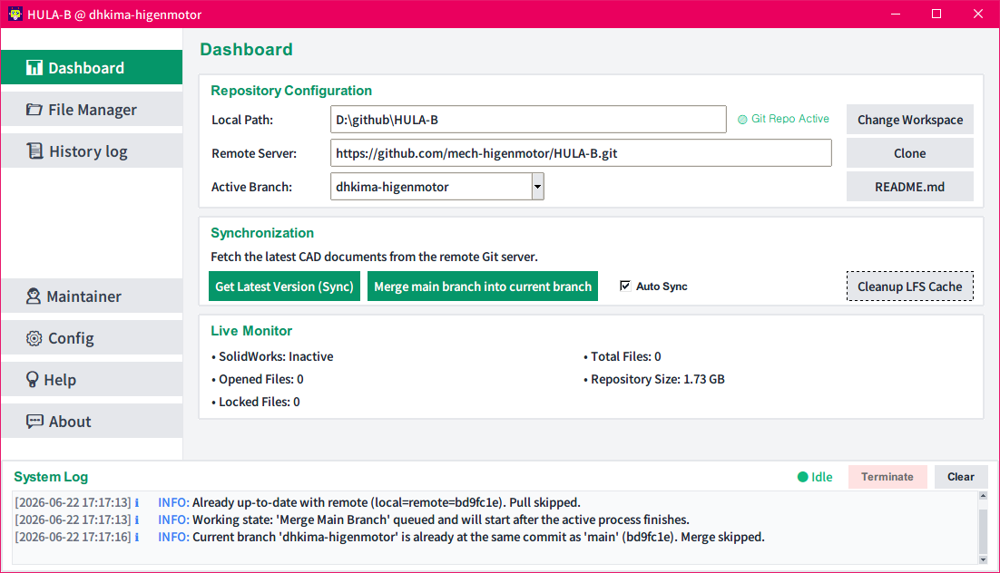
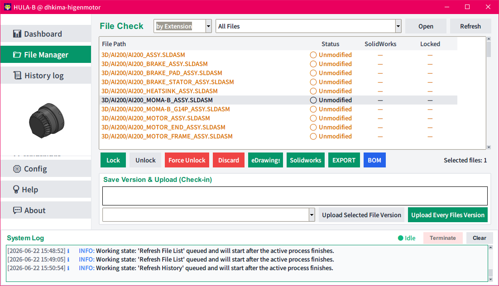

# GIT4SW: SolidWorks Github Version Control Client

[README_ko.md](README_ko.md)

## Necessity

* When performing design work with SolidWorks, 3D CAD binary files such as drawings (`.slddrw`), parts (`.sldprt`), and assemblies (`.sldasm`) cannot be merged at the code level in Git, unlike general text coding tasks. This frequently causes serious issues like overwriting or loss of changes during multi-user collaboration.
* **GIT4SW** is a **SolidWorks-exclusive GitHub integrated version control desktop client** designed to fundamentally prevent version entanglement and conflicts that can occur due to simultaneous modification of these unstructured CAD files by multiple users.
* By combining the standard Git branch workflow with the **Git LFS (Large File Storage) Lock mechanism**, it completely blocks other users from overwriting a file while a specific user is modifying it.





* Demo Movie : [https://youtu.be/SGs7_w_s2pI](https://youtu.be/SGs7_w_s2pI)

---

## 1. Key Features and Characteristics

* **Real-time SolidWorks API Integration Monitoring**: A background thread periodically tracks document objects in the active SolidWorks window. It automatically acquires a remote LFS Lock as soon as the user opens a CAD file and automatically releases the Lock when the window is closed.
* **Work Safety and Upload Prevention Features**:
  - When switching branches or completing a sync, if there are unsaved changes in SolidWorks, it guides the user via a dialog popup to save and close changes first to prevent file corruption and lock conflicts, ensuring safe data coordination.
  - **Safety Check During Upload**: If any of the target files for version upload are currently open in SolidWorks, it blocks the operation with a warning popup. Additionally, if a file locked by someone other than the user is included, users can choose whether to proceed by excluding only those specific files via a Yes/No warning window.
* **Intuitive Color-coding and Sorting by Extension**:
  - Maximized visibility through extension-based color coding in the file table (Part: Green `#059669`, Assembly: Orange `#d97706`, Drawing: Red `#dc2626`).
  - **Enhanced Sorting Options**: A combo box for selecting file list sorting methods has been added with options like `by Status`, `by Solidworks`, and `by Locked`. When `by Status` is selected, files are sorted in the order of **New File -> Modified -> Unmodified**. When `by Solidworks` is selected, **Open files are positioned at the top**. All sorting applies a primary sort criterion followed by a uniform secondary alphabetical sort based on the relative file path (`File Path`).
  - **Shortcut Support**: Pressing `Ctrl+A`, `Ctrl+a`, or `Ctrl+ㅁ` in the File Manager list selects all files at once.
  - **Real-time CAD Thumbnail Preview**: When exactly one SolidWorks file (`.sldprt`, `.sldasm`, `.slddrw`) is selected in the File Manager list, a CAD thumbnail image is automatically extracted and displayed in a borderless preview area (4:3 ratio, 180x135) below the `History log` button in the left sidebar. (Extraction is processed asynchronously via a background thread to prevent UI freezing and supports both direct OLE structure decoding and Windows Shell COM interface hybrid extraction, ensuring perfect previews even for the latest versions like SolidWorks 2026.)
  - **Thumbnail Clipboard Copy**: Clicking on the displayed thumbnail image (the cursor changes to a hand icon) immediately copies the thumbnail bitmap data to the Windows system clipboard, allowing it to be pasted into PowerPoint, Word, or messengers via `Ctrl+V`.
* **Flexible Branch Management and Remote Deployment**:
  - **"Make my branch" function**: Retrieves the user's GitHub account name to automatically create a dedicated remote branch for personal development and synchronizes the upstream, helping users work safely without affecting the `main` branch.
  - **"Merge all branches into main" function**: In Maintainer mode, it provides bulk asynchronous merging of multiple collaborative development branches into the `main` branch along with conflict resolution options (Ours/Theirs selection modal).
* **Background Sequential Queuing and Real-time Process Termination (Terminate button)**:
  - **Sequential Button Execution Queue**: If another action button is clicked while a background process is running ("Working"), the task is added to a waiting queue and starts sequentially after the current task is completely finished.
  - **Git Process Force Termination**: Provides a Terminate button in the System Log panel that can immediately and safely force-terminate the running Git subprocess tree; when terminated, all pending tasks in the queue are also automatically cleared.
* **README.md Shortcut and Auto-sync in Dashboard**: A dedicated README.md edit button is provided to the right of the Active Branch area on the dashboard. Upon finishing editing and closing Notepad, the modified `README.md` file is automatically committed and pushed to the remote Git repository (`git add`, `commit`, `push`). If the file does not exist in the local repository, it automatically creates and applies it from the program template's `template/README.md` before opening Notepad.
* **Auto Sync Function**: An Auto Sync checkbox has been added to the Synchronization category on the dashboard. This enables sequential processing of "Get Latest Version (Sync)" and "Merge main branch into current branch" tasks automatically upon program startup or immediately after repository switching, cloning, or new creation.
* **Powerful Conflict Resolution Popup (LFS Pointer Error Response)**:
  - If a conflict occurs during Sync/Merge/Upload, a multi-selection dialog rendered with system fonts is displayed. Users can select multiple files using the mouse and Ctrl/Shift combinations to perform bulk overwrite resolution (based on Local/Remote or branch name).
  - Even in situations where `git merge` fails due to Git LFS pointer mismatches, it detects the exception, reliably brings up the conflict dialog, and handles it.
* **Maintainer "Make" Repository Auto-registration and Screen Transition**: In Maintainer mode, when a new repository creation (Make) is completed, it automatically registers the new local path and remote address in the Dashboard and Configuration settings and immediately transitions to the Dashboard view.
* **Past Version Exploration and Restoration**: Displays the entire commit history as a list, allowing users to safely revert the workspace to a specific version just by double-clicking an entry (maintaining Standard Detached HEAD state). The history row for the currently checked-out version is clearly indicated with the UI theme's green text color and bold font.
* **Git History Visualization (Graph button)**: A **[Graph]** button is provided at the far right of the Version History Log screen. Clicking it executes a separate windowed terminal (cmd) running the `git log --graph --oneline --all --decorate` command to visualize the entire branch's commit lineage as an ASCII graphic at a glance. The executed Git path automatically tracks the custom `git.exe` path configured in `config.json`.
* **Non-blocking Asynchronous UI Model**: To prevent the screen from freezing during long tasks such as commits, branch pushes, or remote LFS status queries, all operations are split into background multi-threads. An intuitive status is displayed via the bottom `System Log` status indicator (● Working / ● Idle) linked with real-time logs.
* **Independent Executor Path Configuration**: Through `config.json`, both `git.exe` and `git-lfs.exe` execution paths can be perfectly customized, allowing the GitPython engine to call independent executables in special environments like Scoop.
* **Exclusive for GitHub (github.com) Remote Repositories**: This program performs remote branch updates, administrator new repository creation, and integrated deployment via the `PyGithub` API library; therefore, it is tightly designed under the premise of using **github.com remote repository services**.
* **Background Bulk SolidWorks Conversion (EXPORT button)**:
  - A new **[EXPORT]** button is provided next to the file list in the File Manager tab.
  - Clicking this button activates an intuitively designed popup dialog, allowing target files (Part `.sldprt`, Assembly `.sldasm`, Drawing `.slddrw`) to be converted asynchronously in bulk into various specifications (**PDF, DXF, STEP, STEP_ASM**).
  - **Support for Simultaneous Multiple Format Selection**: Multiple formats can be selected via checkboxes for sequential conversion in a single execution. Prefix (`PREFIX` filtering) settings and output subdirectory (`OUTPUT_DIR`, default `2D`) settings are also possible.
  - **Real-time INFO Inquiry**: Through the **[INFO]** button, users can preview summary statistics of the number of drawings, parts, and assemblies to be converted, along with a list of all relative paths in a table format. (The table is sorted by extension name and applies color tags by extension, just like the main file manager, making it easy to check at a glance.)
  - **Safe Non-stop Background Operation**: When the Start button is clicked in the popup, an independent SolidWorks conversion sub-process runs in the background, allowing the main program UI to be used continuously without interruption during the conversion process.
  - **Precise CAD Conversion Quality Control**:
    - **PDF Output**: Forces Black & White conversion and high-quality line output, and automatically controls printer line weight options so that pen tables (thickness, etc.) from drawing properties are accurately reflected in the output.
    - **STEP/STEP_ASM Output**: Strictly specifies the AP214 protocol standard format to ensure that the CAD file's color information (Appearances) and color texture data are fully extracted along with it.
    - **Automatic System Restoration**: Once bulk conversion is complete, it automatically and safely restores the user's original preference default values set in SolidWorks System Options, and a notification dialog is displayed to the user upon completion.

---

## 2. Requirements and Required Software

* **Operating System**: Windows 10 / 11 (x64)
* **CAD System**: Installation of Dassault Systèmes SolidWorks and eDrawings Viewer is mandatory (for real-time drawing tracking based on SolidWorks COM API and opening external eDrawings previews).
* **Required Utilities**:
  - **Git**: `git` version 2.x or higher (path can be specified)
  - **Git LFS**: Extension for handling large files and binary locks
  - **uv**: High-speed Python package and virtual environment manager

  > [!TIP]
  > You can easily install `git`, `git-lfs`, and `uv` using the **Scoop package manager**:
  > ```powershell
  > scoop install git git-lfs uv
  > ```

---

## 3. Execution Method (Automatic Dependency Installation and Startup)

Since this project is based on the high-speed Python package manager `uv`, no separate manual library installation procedure is required.

Simply double-click the **`GIT4SW.bat`** batch file prepared in the project folder to run it immediately.

> [!NOTE]
> `GIT4SW.bat` internally executes `uv run main.py`.
> On the first run, `uv` detects the specifications listed in `pyproject.toml`, automatically builds the virtual environment (`.venv`), and downloads/installs necessary dependency libraries (`gitpython`, `pygithub`, `pywin32`, etc.) before safely launching the program.

---

## 4. User Manual

### 4.1 Initial Setup

After running the program for the first time, you must first perform essential environment settings in the Configuration Manager by clicking the **Config** button at the bottom of the left sidebar menu. After entering the appropriate paths and values in each input field, click the **[Save Configuration]** button at the bottom to save it to `config.json`, which is immediately reflected in the app.

Details and examples for each configuration item are as follows:

* **Git Path**: The absolute path of the `git.exe` binary that the program will call internally to execute Git commands.
  - *Example*: `C:\Users\dhkima\scoop\apps\git\current\bin\git.exe`
* **Git-Lfs Path**: The absolute path of the `git-lfs.exe` executable called to acquire/query Git LFS binary locks.
  - *Example*: `C:\Users\dhkima\scoop\apps\git\current\mingw64\bin\git-lfs.exe`
* **Solidworks Path**: The absolute path of the SolidWorks executable (`SLDWORKS.exe`) installed on your local system. It is used as the execution path when clicking the "Open Solidworks" button in the File Manager or during Fallback exception recovery.
  - *Example*: `C:\Program Files\SOLIDWORKS Corp\SOLIDWORKS\SLDWORKS.exe`
* **Edrawings Path**: The absolute path of the external eDrawings drawing preview executable (`eDrawings.exe`). It is used when clicking the eDrawings button in the File Manager.
  - *Example*: `C:\Program Files\SOLIDWORKS Corp\eDrawings\eDrawings.exe`
* **Github Token**: The GitHub Personal Access Token used for authenticating when creating personal development remote branches or automatically publishing new private repositories in Maintainer mode.
  - *Example*: `ghp_**********************************`
* **Default Local Path**: The default local parent directory path to be used when creating new repositories or performing remote clone operations.
  - *Example*: `C:\Users\dhkima\github`
* **Organization Name**: The name of the GitHub Organization target for automatically opening new private repositories in Administrator mode.
  - *Example*: `mech-higenmotor`
* **Auto Sync**: A Boolean setting variable that determines whether to sequentially execute "Get Latest Version (Sync)" and "Merge main branch" tasks upon program startup or upon completion of repository switching, cloning, or new creation. This is controlled by the Auto Sync checkbox on the Dashboard and is excluded from the manual editing list in the Config screen.
  - *Example*: `true` or `false`


### 4.2 Basic Workflow

1. **Register Workspace**:
   - Set the **Local Path** within the `Repository Configuration` card in the center of the `Dashboard` screen to your actual working folder path. If it is a valid Git repository, `(🟢 Active)` and current branch information will be updated on the right.
2. **Create Personal Development Branch**:
   - Press the **[Make my branch]** button on the Dashboard to create a dedicated branch with the same name as your Current GitHub account or local name, automatically inject the Ref into remote `origin`, and switch to the upstream. (If an identical branch already exists, the button will be disabled and the text will be hidden.)
3. **Open and Edit README.md**:
   - You can open and edit the project information of the workspace in Notepad at any time via the **[README.md]** button located to the right of the Active Branch area on the Dashboard. If the file does not exist in the local workspace, it will be automatically generated from the program template.
4. **SolidWorks Part Design and Automatic Locking**:
   - As soon as you open a part or assembly file in SolidWorks and begin editing, `git lfs lock` is executed by the background monitor. When other collaborators refresh the remote status, that drawing will appear as "Locked," allowing for safe collaboration without fear of losing modifications.
5. **Save and Upload Version (Check-in)**:
   - Once file modification is complete, go to the `File Manager` tab.
  - Use the **[Upload Selected File Version]** button for single or multiple selections, or the **[Upload Every Files Version]** button to stage, commit, and immediately publish all modified/new files in the workspace to the remote branch.
6. **Verify Drawings and Restore (History Log)**:
   - To check a specific history version or revert, enter `History log` mode. Double-clicking a desired commit row will immediately roll back the source and CAD drawings to that commit state.
7. **Bulk Convert Drawing and Model Formats (Export)**:
   - While filtering for the desired range of files in the file list, press the **[EXPORT]** button.
  - Check the target formats (PDF, DXF, STEP, etc.) and enter a `PREFIX` if there are prefix conditions.
  - Press the **[Start]** button; the SolidWorks engine will run in the background and batch convert and save the target files into the specified subdirectories (e.g., `2D/PDF/`, `2D/STEP/`) with high quality, maintaining black & white pen tables (for PDF) and AP214 color (for STEP).

### 4.3 Maintainer Mode (Administrator Functions)

* **Create and Deploy Repository (Make New Repository)**: When planning a new CAD management project, enter the repository name and execute the **[Make]** button to automatically create a Private repository under your GitHub Organization, inject template files (`.gitattributes`, `.gitignore`), and complete everything from main/user branch deployment. Upon completion, the dashboard is automatically updated with the new repository information and transitions to the Dashboard view.
* **Bulk Merge (Merge all branches into main)**: Executed when a project leader wants to merge the progress of all development branches. If a conflict is detected during merging, a popup dialogasking whether to use Ours (keep main) or Theirs (import development branch) is displayed, and merging is performed safely and sequentially in a background thread.

### 4.4 Troubleshooting

#### 4.4.1 Git Authentication with GitHub Token

* Git remote operations (push, pull, locks, etc.) are authenticated seamlessly using the `github_token` configured in `config.json`.
* During execution, the program dynamically unsets local credential helpers and bypasses the Windows Credential Manager (GCM) using an inline temporary helper. This prevents any interactive browser/GCM login popup windows from interrupting your work.
* If authentication fails:
  - Verify that the `github_token` in `config.json` is a valid GitHub Personal Access Token (PAT) with appropriate scopes (especially `repo` or `write` access).
  - Check your internet connection or repository permissions. Do not manually adjust your local/global Git credential helpers.
