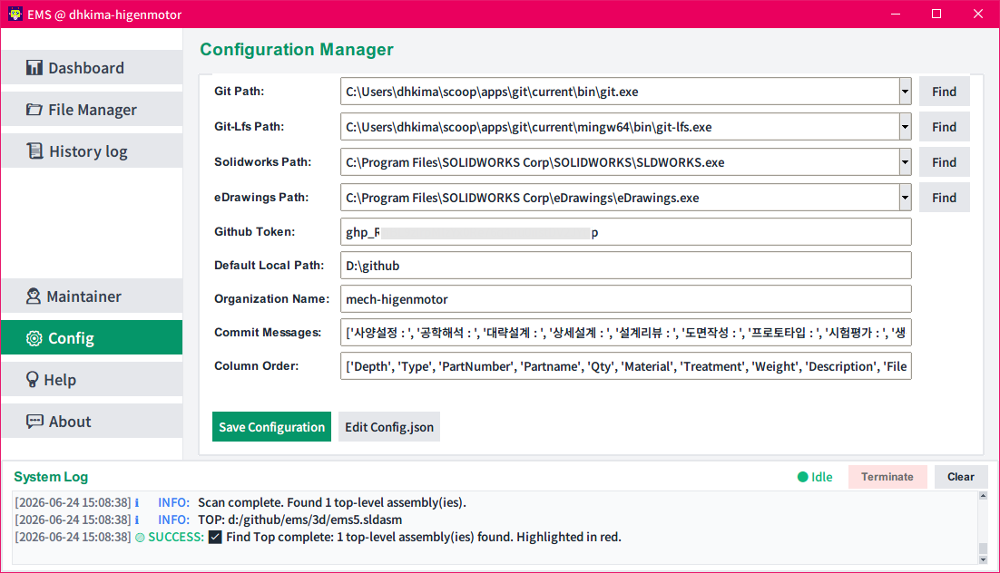
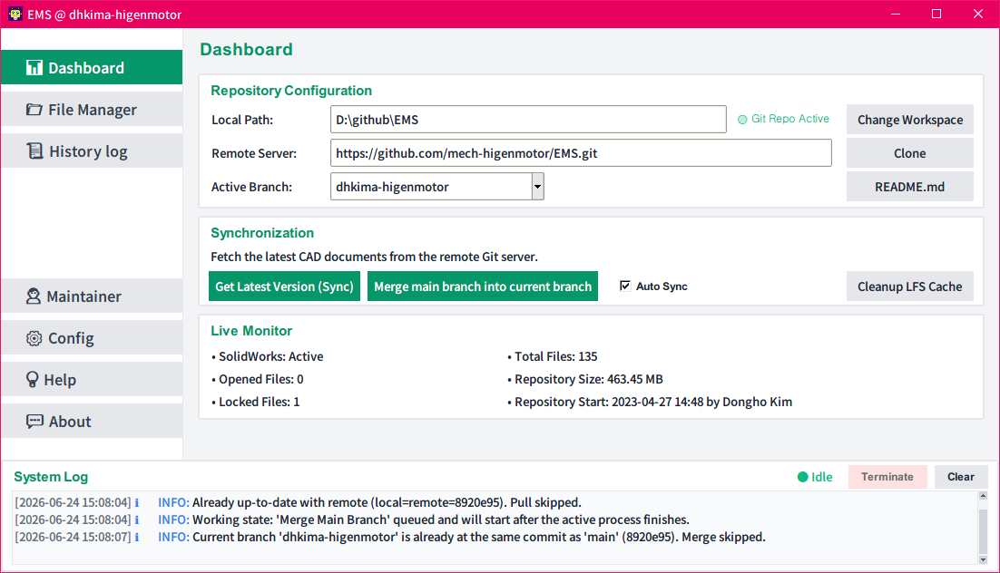
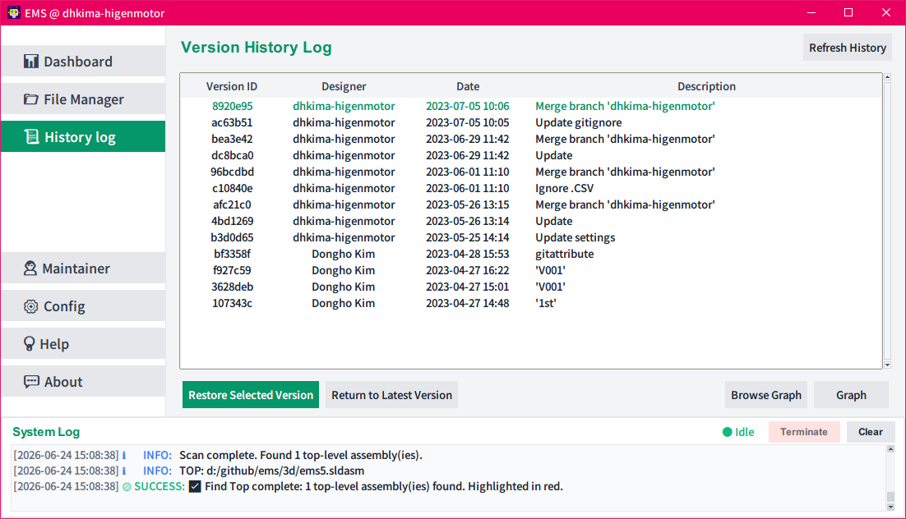
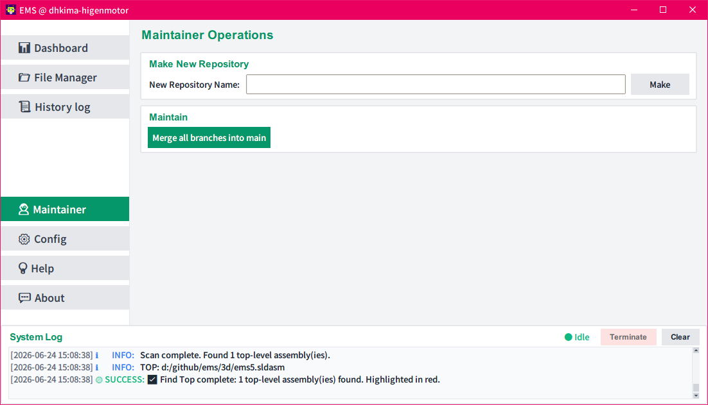

# GIT4SW: SolidWorks Github Version Control Client

[README_en.md](README.md)

## 필요성

* SolidWorks로 설계 작업을 진행할 때 도면(`.slddrw`), 파트(`.sldprt`), 어셈블리(`.sldasm`) 등의 3D CAD 바이너리 파일은, 일반 텍스트 코딩 작업과 다르게 Git에서 코드 차원 병합(Merge)이 불가능하여, 다자간 협업 시 덮어쓰기나 변경점 소실 등의 심각한 문제가 수시로 발생합니다.
* **GIT4SW**는 이러한 비정형 CAD 파일들의 다자간 동시 수정으로 발생할 수 있는 버전 엉킴과 충돌을 원천 예방하기 위해 고안된 **SolidWorks 전용 Github 연동 버전 관리 데스크톱 클라이언트**입니다. 
* 표준 Git 브랜치 워크플로우에 **Git LFS(Large File Storage) Lock 메커니즘**을 결합하여, 특정 사용자가 파일을 수정하는 동안 다른 사용자가 동일한 파일을 덮어쓰지 못하도록 사전에 완벽 차단해 줍니다.


* Demo Movie : [https://youtu.be/SGs7_w_s2pI](https://youtu.be/SGs7_w_s2pI)

---

## 1. 주요 기능

* **자동 Lock 및 모니터링**: 백그라운드 스레드가 SolidWorks COM API로 열린 파일을 추적하여, CAD 파일 열면 LFS Lock 획득, 닫으면 자동 해제. 대시보드에 실시간 저장소 용량 표시.
* **LFS 캐시 정리 마법사**: `.git/lfs/objects/` 내 미사용 캐시를 안전하게 삭제하는 GUI 도구. 현재 인덱스 + 최근 2개 커밋만 보존.
* **작업 안전성**: 파일이 SolidWorks에 열려 있거나 타인이 Lock한 경우 업로드 차단. 브랜치 전환 시 미저장 변경사항 경고. SolidWorks 버튼만 LFS Lock 관리; eDrawings/EXPORT/BOM은 ReadOnly 모드 사용.
* **색상 구분 파일 목록**: 파트 초록 `#059669`, 어셈블리 주황 `#d97706`, 도면 빨강 `#dc2626`. 이름/확장자/상태/SW 열림/Lock 여부로 정렬 가능.
* **CAD 썸네일 미리보기**: 선택한 CAD 파일의 4:3 썸네일 자동 표시; 클릭 시 클립보드에 복사.
* **브랜치 관리**: "Make my branch"로 개인 원격 브랜치 자동 생성. "Merge all branches into main"으로 일괄 병합 및 충돌 해결(Ours/Theirs).
* **순차 작업 큐**: 백그라운드 작업은 자동 큐잉; Terminate 버튼으로 멈춘 Git 프로세스 강제 종료.
* **자동 동기화 (Auto Sync)**: 시작/저장소 변경 시 자동 fetch 및 병합; 이미 최신이면 생략.
* **충돌 해결**: 다중 파일 선택 대화상자, 충돌 파일 자동 `.backup/` 백업. LFS 포인터 오류 처리.
* **EXPORT (일괄 변환)**: `.sldprt`/`.sldasm`/`.slddrw` → PDF, DXF, STEP(AP214 컬러). 다중 포맷 동시 선택. Watchdog(180초)가 멈춘 SolidWorks 자동 재시작. 파일 기준(설정 기준 아님) 진행률.
* **BOM 추출**: 어셈블리 재귀 탐색 → 계층 BOM Tree + 납작 Partlist를 Excel(`.xlsx`)로 저장. 억제/BOM 제외 부품 필터링. 다중 설정 선택 지원.
* **Visual Diff (Diff 버튼)**: Git 커밋 이력 조회 후, 현재 버전(`_OURS`)과 선택한 커밋(`_THEIRS`)을 SolidWorks에서 나란히 열어 수동 비교 (파트: Geometry Compare, 도면: Draw Compare).
* **버전 이력 및 그래프**: 커밋 더블클릭으로 워크스페이스 복원. ASCII 그래프(cmd) 또는 GitHub Network 브라우저.
* **GitHub 전용**: PyGithub을 통한 github.com 원격 저장소 연동.
* **Find Top (최상위 어셈블리 스캐너)**: `.sldasm` 의존성 그래프를 분석하여 최상위 어셈블리(다른 어셈블리에서 참조되지 않은 파일)를 식별. `GetDocumentDependencies2` COM API 사용—파일을 열지 않고 메타데이터만 읽어 `OpenDoc6` 방식보다 수배에서 수십 배 빠름.
* **성능 최적화**: EXPORT/BOM 중 자동 Lock 억제 (ReadOnly 파일은 Lock 불필요). 모든 안정화 대기 시간 50% 단축.
* **Config 편집기**: "Edit Config.json" 버튼으로 설정 파일을 메모장에서 직접 편집.


---

## 2. 요구 환경 및 필수 소프트웨어

* **운영체제**: Windows 10 / 11 (x64)
* **CAD 시스템**: Dassault Systèmes SolidWorks 및 eDrawings 뷰어 설치 필수 (SolidWorks COM API 기반 실시간 도면 추적 및 eDrawings 외부 미리보기 열기 실행 목적)
* **필수 유틸리티**:
  - **Git**: `git` 버전 2.x 이상 (경로 지정 가능)
  - **Git LFS**: 대형 파일 및 바이너리 락 처리를 위한 확장 기능
  - **uv**: 고속 Python 패키지 및 가상환경 관리자

  > [!TIP]
  > **Scoop 패키지 관리자**를 사용하여 `git`, `git-lfs`, `uv`를 손쉽게 설치할 수 있습니다:
  > ```powershell
  > scoop install git git-lfs uv
  > ```

---

## 3. 실행 방법 (자동 의존성 설치 및 구동)

본 프로젝트는 고속 Python 패키지 관리자인 `uv`를 기반으로 하므로 별도의 수동 라이브러리 설치 절차가 필요 없습니다.

프로젝트 폴더 내에 준비된 **`GIT4SW.bat`** 배치 파일을 더블클릭하여 바로 실행하면 됩니다.

> [!NOTE]
> `GIT4SW.bat`는 내부적으로 `uv run main.py`를 실행시킵니다.
> 최초 실행 시 `uv`가 `pyproject.toml`에 기재된 스펙을 감지하여 가상환경(`.venv`)을 자동으로 빌드하고 필요한 의존성 라이브러리(`gitpython`, `pygithub`, `pywin32` 등)를 알아서 다운로드 및 설치한 뒤 프로그램을 안전하게 구동해 줍니다.

---

## 4. 사용 설명서

### 4.1 초기 설정



프로그램을 최초로 실행한 후, 좌측 사이드바 메뉴 맨 하단의 **Config** 버튼을 눌러 설정 화면(Configuration Manager)에서 필수 환경 설정을 먼저 진행해야 합니다. 각 입력 필드에 알맞은 경로와 값을 입력한 후 하단의 **[Save Configuration]** 버튼을 클릭하면 `config.json`에 저장되고 앱에 즉시 반영됩니다. 또한 **[Edit Config.json]** 버튼을 클릭하면 설정 파일을 메모장에서 직접 편집할 수 있습니다.

각 설정 항목의 상세 내용 및 예시는 다음과 같습니다:

* **Git Path**: 프로그램이 내부적으로 Git 명령을 호출해 실행할 `git.exe` 바이너리의 절대 경로입니다.
  - *예*: `C:\Users\dhkima\scoop\apps\git\current\bin\git.exe`
* **Git-Lfs Path**: Git LFS 바이너리 락 획득/조회를 위해 호출할 `git-lfs.exe` 실행 파일의 절대 경로입니다.
  - *예*: `C:\Users\dhkima\scoop\apps\git\current\mingw64\bin\git-lfs.exe`
* **Solidworks Path**: 로컬 시스템에 설치된 SolidWorks 실행 파일(`SLDWORKS.exe`)의 절대 경로입니다. 파일 매니저에서 Solidworks 열기 버튼 클릭 시 및 Fallback 예외 복구 시 실행 경로로 사용됩니다.
  - *예*: `C:\Program Files\SOLIDWORKS Corp\SOLIDWORKS\SLDWORKS.exe`
* **eDrawings Path**: 외부 eDrawings 도면 미리보기 실행 파일(`eDrawings.exe`)의 절대 경로입니다. 파일 매니저에서 eDrawings 버튼 클릭 시 사용됩니다.
  - *예*: `C:\Program Files\SOLIDWORKS Corp\eDrawings\eDrawings.exe`
* **Github Token**: 사용자의 개인 개발용 원격 브랜치를 생성하거나, Maintainer 모드에서 원격 비공개(Private) 저장소를 자동 퍼블리싱할 때 인증용으로 사용할 GitHub 개인 액세스 토큰(Personal Access Token)입니다.
  - *예*: `ghp_**********************************`
* **Default Local Path**: 신규 저장소 생성 및 원격 클론 작업 시 기본으로 사용할 로컬 부모 디렉터리 경로입니다.
  - *예*: `C:\Users\dhkima\github`
* **Organization Name**: 관리자 모드에서 신규 비공개 저장소를 자동 개설할 대상 GitHub 조직(Organization)의 이름입니다.
  - *예*: `mech-higenmotor`
* **Auto Sync**: 프로그램 구동 시 또는 저장소 스위칭/클론/신규 생성 작업 완료 시 자동으로 원격 동기화(Get Latest Version) 및 메인 브랜치 병합(Merge main branch)을 순차 실행할지 여부를 결정하는 Boolean 설정 변수입니다. 대시보드의 Auto Sync 체크박스로 제어되며 Config 화면의 수동 편집 목록에서는 제외됩니다.
  - *예*: `true` 또는 `false`


### 4.2 기본 작업 워크플로우

1. **워크스페이스 등록**:
   - `Dashboard` 화면 중앙의 `Repository Configuration` 카드 내에서 **Local Path**를 사용자의 실제 작업 폴더 경로로 설정합니다. 유효한 Git 저장소일 경우 우측에 `(🟢 Active)` 표시와 현재의 브랜치 정보가 갱신됩니다.

2. **개발용 개인 브랜치 생성**:
   - 대시보드에서 **[Make my branch]** 버튼을 누르면 현재 GitHub 계정 명칭 혹은 로컬 명칭과 동일한 이름의 전용 브랜치를 생성하고 자동으로 원격 origin에 Ref를 주입하며 업스트림으로 전환됩니다. (이미 동일한 브랜치가 존재하는 경우 버튼은 비활성화 처리되어 텍스트가 노출되지 않도록 가려집니다.)



3. **README.md 열기 및 수정**:
   - 대시보드의 Active Branch 영역 우측에 배치된 **[README.md]** 버튼을 통해 언제든지 워크스페이스의 프로젝트 정보를 메모장으로 열고 편집할 수 있습니다. 로컬 워크스페이스에 파일이 없는 경우, 프로그램 템플릿에서 자동으로 생성하여 적용해 줍니다.


4. **SolidWorks 부품 설계 및 자동 잠금**:
   - SolidWorks에서 파트나 어셈블리 파일을 오픈하여 수정을 시작하는 즉시 백그라운드 모니터에 의해 `git lfs lock` 명령이 실행됩니다. 타 협업 개발자가 원격 상태를 새로고침하면 해당 도면이 "잠김" 상태로 표시되므로 수정 소실 걱정 없이 안전하게 협업이 유지됩니다.

5. **저장 및 버전 업로드 (Check-in)**:
   - 파일 수정이 완료되면 `File Manager` 탭으로 이동합니다.
   - 단일 또는 다중 선택 상태에서 **[Upload Selected File Version]** 또는 워크스페이스 내 수정/신규 파일을 모두 스테이징하여 커밋하고 즉시 원격 브랜치로 게시해 주는 **[Upload Every Files Version]** 버튼을 통해 업로드합니다.



6. **도면 확인 및 복원 (History Log)**:
   - 특정 이력 버전을 확인하거나 되돌려야 할 때는 `History log` 모드에 진입합니다. 원하는 커밋 줄을 더블클릭하면 해당 커밋 상태로 소스 및 CAD 도면들이 즉시 롤백 복원됩니다.

7. **도면 및 모델 포맷 일괄 변환 (Export)**:
   - 파일 목록에서 원하는 범위의 파일들을 필터링한 상태에서 **[EXPORT]** 버튼을 누릅니다.
   - 변환할 포맷(PDF, DXF, STEP 등)을 체크하고 접두사 조건이 있다면 `PREFIX`를 입력합니다.
   - **[Start]** 버튼을 누르면 백그라운드에서 솔리드웍스 엔진이 실행되어 대상 파일들을 지정된 하위 경로(예: `2D/PDF/`, `2D/STEP/`)에 흑백 펜테이블(PDF) 및 AP214 컬러(STEP)를 살려 고품질로 일괄 변환 및 저장합니다.

8. **어셈블리 BOM 및 파트리스트 추출**:
   - File Manager 파일 목록에서 단 하나의 어셈블리(`.sldasm`) 파일을 선택하고 **[BOM]** 버튼을 누릅니다.
   - 대상 어셈블리에 2개 이상의 설정이 존재하는 경우, 설정 선택 팝업창에서 원하는 설정을 선택합니다.
   - 추출 프로세스가 백그라운드에서 완료된 후, 해당 어셈블리 폴더 하위의 `2D/BOM/` 경로에 저장된 `[어셈블리명]__BOM.xlsx` (계층 트리 구조) 및 `[어셈블리명]__PL.xlsx` (납작한 전체 부품 목록) 엑셀 파일을 확인합니다.

9. **Git LFS 캐시 정리 (Cleanup LFS Cache)**:
   - 로컬 디스크 공간이 부족해지면 대시보드의 **[Cleanup LFS Cache]** 버튼을 클릭하여 정리 마법사 창을 실행합니다.
   - 마법사가 자동으로 `.git/lfs/objects/` 경로를 분석하여 최근 2개 커밋 및 인덱스에서 쓰이지 않는 이전 캐시 파일의 수와 예상 정리 공간 용량을 표시합니다. [Cleanup Cache] 버튼을 클릭해 미사용 파일들을 안전하게 일괄 삭제하고 공간을 확보할 수 있습니다.

10. **Find Top (최상위 어셈블리 스캔)**:
    - File Manager 툴바의 **[Find Top]** 버튼(Refresh 우측)을 클릭하여 워크스페이스의 `.sldasm` 의존성 그래프를 스캔합니다.
    - SolidWorks `GetDocumentDependencies2` API를 사용하여 파일을 열지 않고 의존성 메타데이터만 읽으므로 기존 `OpenDoc6` 방식보다 매우 빠릅니다.
    - 식별된 최상위 어셈블리는 파일 목록에서 빨간색 굵게 `#dc2626` "TOP" 태그로 강조 표시됩니다. "최상위"란 워크스페이스 내 다른 `.sldasm`에서 참조되지 않은 파일을 의미합니다.


### 4.3 관리자 기능 (Maintainer Mode)



* **저장소 생성 및 배포 (Make New Repository)**: 신규 CAD 관리용 프로젝트를 기획 시, 저장소 이름을 입력하고 **[Make]** 버튼을 실행하면 GitHub 조직 하위에 Private 저장소를 생성하고 템플릿 파일(`.gitattributes`, `.gitignore`)을 주입한 뒤 main/user 브랜치 배포까지의 모든 과정을 자동으로 마칩니다. 완료 후 생성된 저장소 정보로 대시보드가 즉시 자동 갱신되며 대시보드로 이동합니다.

* **일괄 병합 (Merge all branches into main)**: 프로젝트 리더가 개발 브랜치들의 모든 진척 상황을 병합하려 할 때 실행합니다. 병합 도중 충돌(Conflict)이 감치되면 Ours(main 유지) 또는 Theirs(개발 브랜치 이식)를 묻는 팝업 다이어로그를 띄워 백그라운드 스레드에서 안전하고 순차적으로 병합 처리를 진행해 줍니다.

### 4.4 트러블슈팅

#### 4.4.1 GitHub 토큰을 이용한 Git 인증

* Git 원격 작업(push, pull, locks 등)은 `config.json`에 설정된 `github_token`을 사용하여 자동으로 인증이 완료됩니다.
* 프로그램은 실행 시 동적 인라인 헬퍼 주입 방식을 사용하여 윈도우 시스템 자격증명관리자(GCM)를 완전히 무시하고 자체적으로 처리하므로, 작업 중 복잡한 로그인 팝업 창이 전혀 뜨지 않습니다.
* 만약 자격증명 오류나 권한 문제가 발생한다면:
  - `config.json` 파일의 `github_token` 항목에 적절한 리포지토리 제어 권한(특히 `repo` 또는 `write` 권한)을 가진 올바른 GitHub 개인 액세스 토큰(PAT)이 설정되어 있는지 확인하십시오.
  - 네트워크 연결 상태 또는 GitHub 저장소에 대한 접근 권한을 확인하십시오. 로컬/전역 Git의 credential helper를 수동으로 수정할 필요가 전혀 없습니다.

#### 4.4.2 덮어씌워진 로컬 작업 파일의 복구
* 충돌 해결 단계에서 실수로 "Theirs"(원격 서버 버전)를 선택하여 작업 내용을 덮어썼더라도, 워크스페이스 루트의 `.backup/` 폴더에서 이전의 원본 작업 데이터를 찾을 수 있습니다.
* 충돌 팝업이 뜨기 직전에 충돌이 감지된 모든 파일이 `[파일명]_[YYYYMMDD_HHMMSS].[확장자]` 형태의 타임스탬프 파일명으로 복사 저장됩니다.
* 복구하려면 해당 백업 파일을 원래 위치로 복사하고 파일명에서 타임스탬프 부분을 지워주면 됩니다.

#### 4.4.3 EXPORT 실행 중 SOLIDWORKS CAM 애드인 팝업이 나타나는 경우

EXPORT 일괄 변환을 실행할 때 **SOLIDWORKS CAM** 애드인에 의한 팝업이 나타나면, 현재 SolidWorks에 SOLIDWORKS CAM 애드인이 활성화된 상태임을 의미합니다. 이 애드인은 자체 초기화 및 경고 다이얼로그를 표시하여 백그라운드 자동 변환 프로세스를 막고 진행을 자주 방해합니다.

**해결 방법**: EXPORT 실행 전에 SolidWorks에서 SOLIDWORKS CAM 애드인을 중지하십시오:
1. SolidWorks를 엽니다.
2. 상단 메뉴에서 **도구(Tools) → 애드인(Add-ins...)** 을 선택합니다.
3. 애드인 목록에서 **SOLIDWORKS CAM** 항목을 찾습니다.
4. "활성 애드인(Active Add-ins)" 체크박스와 "시작 시 로드(Start Up)" 체크박스 **둘 다** 체크를 해제합니다.
5. **확인(OK)**을 클릭하고 SolidWorks를 닫습니다.
6. EXPORT를 다시 실행하면 팝업이 더 이상 나타나지 않습니다.

> [!NOTE]
> 이 설정은 한 번만 하면 됩니다. SOLIDWORKS CAM을 비활성화하면 SolidWorks가 해당 설정을 저장하며, 이후 EXPORT를 실행할 때도 비활성화 상태로 유지됩니다.

#### 4.4.4 SolidWorks에서 열린 어셈블리 내 하위 참조 부품이 '읽기 전용' 상태로 로드되는 경우

GIT4SW의 **[Solidworks]** 버튼을 클릭하여 어셈블리(`.sldasm`) 파일을 열었을 때, SolidWorks의 기본 시스템 옵션 설정에 따라 어셈블리에 포함된 하위 서브어셈블리(`.sldasm`) 및 파트(`.sldprt`) 파일들이 **'읽기 전용'** 상태로 열릴 수 있습니다.
이 경우, 도면을 수정하더라도 변경 내용이 디스크에 정상적으로 저장되지 않아, 결국 GIT4SW의 파일 매니저에서 변경 상태가 감지되지 않고 Check-in(업로드)이 불가능한 현상이 발생합니다.

**해결 방법**: SolidWorks 시스템 옵션에서 참조 문서 관련 설정을 다음과 같이 변경하십시오:
1. SolidWorks를 실행합니다.
2. 상단 메뉴에서 **도구(Tools) → 옵션(Options...)** 을 선택합니다.
3. **시스템 옵션(System Options)** 탭의 좌측 목록에서 **외부 참조(External References)** 항목을 선택합니다.
4. **"참조 문서를 읽기 전용으로만 열기(Open referenced documents with read-only access)"** 체크박스를 해제(체크 해제)합니다.
5. **확인(OK)**을 클릭하여 설정을 저장한 후 SolidWorks를 종료합니다.
6. 이제 어셈블리를 다시 열면 하위 참조 부품들도 쓰기 가능 상태로 정상 로드됩니다.

