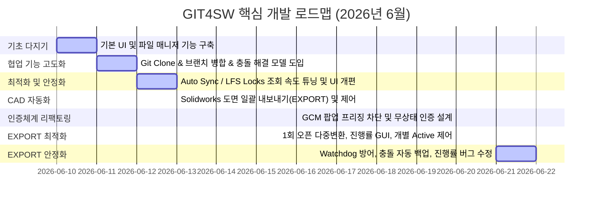

# GIT4SW 프로젝트 개발 역사 및 커밋 분석서 (Development History & Commit Analysis)

**GIT4SW**는 SolidWorks CAD 파일의 특성(바이너리, 대용량, 다중 사용자 동시 수정 충돌 위험)을 고려하여 Git LFS 및 원격 저장소(GitHub, Codeberg) 환경에서 도면/모델 데이터의 협업을 안전하고 효율적으로 제어할 수 있도록 설계된 Python/Tkinter 기반의 GUI 형상 관리 보조 프로그램입니다.

본 문서는 프로젝트의 최초 커밋(2026-06-10)부터 최신 릴리즈까지 전체 Git 커밋 그래프와 개발 이력을 종합적으로 분석하여, 프로젝트가 어떠한 단계를 거쳐 현재의 수준 높은 도구로 성장했는지 체계적으로 기술합니다.

---

## 📅 전체 개발 타임라인 및 마일스톤 요약

---

## 🔍 단계별 상세 개발 내역

### 1단계: 프로젝트 기초 설계 및 파일 관리 기능 구축 (Milestone 1)
**기간:** 2026-06-10 ~ 2026-06-11
* **핵심 커밋 범위:** `b81f9a3 (V01)` ~ `b86c533`
* **주요 변경 사항 및 개발 동기:**
  - **프로젝트 출범 (`b81f9a3`)**: 최초 프로토타입(V01) 개발 및 원격 저장소 연동(Codeberg 링크 연동) 완료.
  - **기초 파일 매니저 구현 (`0aedaa3`, `65fef00`)**: 로컬 작업 폴더 내 CAD 파일들의 변경 이력 및 Git LFS 상태를 추적하기 위한 기초 뷰어 구축. Windows 환경에서의 대소문자 구분 없는 파일 잠금(case-insensitive LFS lock) 처리 지원.
  - **예외 처리 및 성능 보호 (`8cb64a4`, `4145869`)**: 백그라운드 동기화 과정에서 GUI가 멈추는(Freezing) 현상을 막기 위해 로그 쓰기 작업(`write_log`)의 Thread-safe 처리를 도입하고 `.gitignore`에 잡힌 임시 파일들은 파일 목록 탐색에서 자동 제외하도록 예외 필터 장착.
  - **SolidWorks 연동의 초석 (`65fef00`, `b86c533`)**: SolidWorks가 현재 켜져 있는지 여부를 감시하여 대시보드 내 카드 위젯에 `Active`/`Inactive` 상태를 실시간으로 출력하기 시작함.

---

### 2단계: Git Clone / Merge 고도화 및 conflict 제어 모델 도입 (Milestone 2)
**기간:** 2026-06-11 ~ 2026-06-12
* **핵심 커밋 범위:** `15eebda` ~ `3b0da00`
* **주요 변경 사항 및 개발 동기:**
  - **Repository 원격 설정 및 복제 (`60a4228` ~ `015fb05`)**: GUI 상에서 Remote Server 주소를 입력하여 바로 원격 저장소를 `Clone`할 수 있는 마법사 및 클론 경로 자동 보정 로직 개발. 로그 내 `github_token`이 노출되는 것을 사전에 가리는 마스킹 기능 이식.
  - **배포 & 병합 안정성 향상 (`31b9c85` ~ `aacae31`)**: 원격 서버의 다양한 브랜치가 서로 다이버징(Diverged) 되었을 때, 단순 `git pull`이 아닌 `git fetch` 후 `git merge` 처리를 하도록 병합 동작 개선. 병합이 끝난 뒤 원본 브랜치로 자동 롤백 및 푸시하도록 자동화 흐름 구축.
  - **다중 충돌 해결 도구 도입 (`924afc1`)**: 로컬 파일과 원격 서버의 파일이 겹쳐 충돌이 발생할 경우, 사용자가 이를 쉽게 제어할 수 있도록 **`MultiConflictResolutionDialog`**라는 다중 충돌 해결 대화창을 설계하여 분기 처리를 직관적으로 개선.
  - **커밋 템플릿 로더 (`b9d0581` ~ `3b0da00`)**: 작업 성격에 맞는 양질의 커밋 메시지 작성을 위해 외부 workspace 혹은 앱 폴더 내에 저장된 커밋 템플릿 양식을 동적으로 불러오는 컴보박스 위젯 연동.

---

### 3단계: 자동 동기화(Auto Sync) 및 캐시 최적화 (Milestone 3)
**기간:** 2026-06-12
* **핵심 커밋 범위:** `21e9953` ~ `f17c02f`
* **주요 변경 사항 및 개발 동기:**
  - **Auto Sync (자동 동기화) 구현 (`21e9953` ~ `3c354eb`)**: 매번 수동으로 동기화 버튼을 누르지 않아도 체크박스 상태에 따라 변경 사항이 발생할 경우 백그라운드에서 자동으로 main 브랜치와 병합하는 자동 동기화 기능 추가. 설정 파일(`config.json`)과의 영구 지속성 지원.
  - **OS 특화 한글 경로 디코딩 (`adc485a`, `6fc9ee9`)**: Windows Git 터미널 출력에서 논아스키(한글 등) 도면 파일명이 8진수 이스케이프 형태로 깨져 출력되는 이슈를 해결하기 위한 디코딩 핸들러 반영 및 하위 폴더 추적을 위한 `git status -u` 파싱 튜닝.
  - **백그라운드 병목 해결 (`1079c37` ~ `f17c02f`)**: 느린 성능의 PC 환경에서 백그라운드 모니터링 루프가 1초마다 LFS Locks를 조회하느라 과도한 CPU 연산을 소모하던 현상 포착. **"오직 열려 있는 파일 목록의 해시값에 변화가 있을 때만 LFS Locks 갱신 조회를 보낸다"**는 조건 처리를 이식하여 CPU 부하량을 획득 수준으로 제어.
  - **파일 정렬 및 탐색 확장 (`50e70b3` ~ `5c5a5d3`)**: 단순 이름 정렬 외에도 SolidWorks 파일 우선순위(부품 -> 도면) 정렬, 상태별 커스텀 정렬 및 알파벳 2차 정렬 기준 지정으로 수많은 파일 목록을 신속히 파악하도록 개선.

---

### 4단계: SolidWorks 도면 일괄 EXPORT 자동화 (Milestone 4)
**기간:** 2026-06-13
* **핵심 커밋 범위:** `cea6f57` ~ `b7c95eb`
* **주요 변경 사항 및 개발 동기:**
  - **도면 내보내기(EXPORT) 최초 탑재 (`a2f78ed`)**: SolidWorks API와 직접 OLE 연동하여 대량의 slddrw, sldprt, sldasm 도면/모델 파일을 버튼 하나로 PDF(흑백/펜 테이블 옵션), DXF, STEP(AP214 컬러 지정) 포맷으로 일괄 변환 저장해 주는 자동 변환 매크로 기반 모듈 개발.
  - **저장 재촉 팝업 억제 (`883ebb8`, `8281ce6`)**: 대량 변환 도중 파일에 저장되지 않은 임시 값 등이 있을 때 SolidWorks가 띄우는 "저장하시겠습니까?" 팝업창으로 인해 프로세스가 멈추는 문제를 방지하고자, 문서 닫기 API 호출 방식을 최적화하고 경고 및 안내 팝업을 가로채 차단 처리.

---

### 5단계: Git 인증 무상태(Stateless) 우회 설계 (Milestone 5)
**기간:** 2026-06-20
* **핵심 커밋 범위:** `34d3ac2` ~ `38e6e61`
* **주요 변경 사항 및 개발 동기:**
  - **Windows GCM 팝업 프리징 분석**: Git push/pull 시 윈도우 시스템 자격증명관리자(GCM)가 계정 입력을 촉구하며 백그라운드에 감춰진 대화창을 띄워 프로그램 전체가 락이 걸리는(Deadlock) 심각한 고질적 문제 인지.
  - **로컬 헬퍼 주입 설계 (`1e4d418` ~ `b4c951a`)**: 시스템 GCM 체인을 우회하고 메모리의 `GIT4SW_TOKEN`을 자격증명 인터페이스 규격(stdin)으로 반환하는 독립형 자격증명 도우미 스크립트([git_helper.py](file:///d:/codeberg/GIT4SW/git_helper.py)) 개발 및 로컬 바인딩.
  - **무상태(Stateless) 인라인 기법으로 리팩토링 (`6c01ee0`, `38e6e61`)**: `.git/config` 파일에 헬퍼 경로를 계속해서 적고 지우는 작업은 파일 손상 및 I/O 낭비를 유발하므로, Git 명령어 호출 시점에만 인라인 파라미터(`-c credential.helper= -c credential.helper="..."`) 형태로 자격증명 체인을 강제 빈 슬롯으로 밀어 넣은 뒤 임시 헬퍼를 체인하여 동적으로 인증하도록 변경. 이로써 어떠한 잔여물 없이 깔끔하고 빠른 원격 처리가 완료됨.

---

### 6단계: EXPORT 흐름 고도화 및 세부 파일 선택(Active On/Off) 설계 (Milestone 6)
**기간:** 2026-06-20
* **핵심 커밋 범위:** `08d6f17`
* **주요 변경 사항 및 개발 동기:**
  - **도면 파일 1회 오픈 최적화**: 기존에는 PDF와 DXF 변환 시 각각 slddrw 파일을 처음부터 열고 닫는 과정을 반복했으나, **파일 1회 열기 ➔ PDF 저장 ➔ DXF 저장 ➔ 파일 닫기**의 원스톱 시퀀스로 리팩토링하여 디스크 및 CAD 엔진 자원 낭비를 절반으로 감소시킴.
  - **변환 실행 흐름 고정**: 포맷이 꼬이지 않도록 변환 및 진행 순서를 항상 `PDF -> DXF -> STEP -> STEP_ASM` 순으로 강제 정렬.
  - **비동기 프로그레스바 모달 팝업**: 변환 도중 메인 UI가 전혀 먹통이 되지 않도록 파이프라인 감시 백그라운드 데몬 스레드를 돌려 실시간으로 변환 진행률(`x/y번째 파일 변환 중`)을 갱신하는 모달 창 구축. 테마인 에메랄드 그린 컬러바(`Custom.Horizontal.TProgressbar`) 적용.
  - **INFO 창 내 Active On/Off 기능 구현**:
    - "Detailed Files List" 텍스트 라벨을 삭제하여 콤팩트한 화면 영역 확보.
    - 테이블 내에 각 파일이 변환에 참가할지 여부를 선택하는 **Active(On/Off)** 열 신설. (On: 파란색, Off: 회색 지정)
    - `Ctrl+클릭`, `Shift+클릭` 및 `Ctrl+A`를 연동하여 여러 행을 마우스와 단축키로 쉽게 전체 지정 가능.
    - `On`/`Off` 일괄 지정 버튼을 통해 변환 활성화 파일을 손쉽게 거르고, Close를 누르면 이 동적 필터 리스트가 메모리에 유지되어 최종 EXPORT 시작 시점에 타겟 파일 목록에 엄격히 대입되도록 설계.

---

### 7단계: EXPORT Watchdog 방어 및 충돌 파일 자동 백업 (Milestone 7 - 2026-06-21)
* **EXPORT 개별 파일 변환 Watchdog 타이머**:
  - 개별 도면 파일 변환 시 발생할 수 있는 SolidWorks 엔진의 무한 대기 및 교착 상태(Deadlock)를 방지하기 위해 **3분(180초) Watchdog 타이머**를 구현하였습니다.
  - 각 파일의 변환 처리를 `--single` 옵션의 재귀 서브프로세스로 분리하여 가동하며, 제한 시간 초과 시 서브프로세스 강제 종료 및 기존 SolidWorks PID `taskkill` 처리 후 새 인스턴스를 재생성하여 다음 파일 변환으로 자동 복원 및 계속 진행하도록 설계했습니다.
* **원격 동기화 시 충돌 파일 자동 백업 (.backup/ 폴더)**:
  - 병합(Merge) 및 풀(Pull) 도중 발생한 단일/다중 충돌 상황에서 사용자에게 충돌 해결을 묻기 직전, 수정 전 로컬 작업 파일 복사본을 자동으로 안전한 임시 디렉토리에 보존하는 백업 메커니즘을 구현하였습니다.
  - 워크스페이스 내에 `.backup/` 폴더를 생성하고, 충돌 파일의 로컬 버전을 `파일명_YYYYMMDD_HHMMSS.확장자` 형태로 복사하여 보존합니다.
  - 백업된 파일이 불필요하게 Git 트래킹 목록에 포함되지 않도록 `template/_gitignore` 설정에 `.backup/` 패턴을 예외 처리로 반영하였습니다.

---

### 8단계: EXPORT 안정화 — 코드 정리, 진행률 카운트 수정, 조기 중단 버그 수정 (Milestone 8 - 2026-06-22)
* **BOM 기능 및 SOLIDWORKS CAM 코드 완전 제거**:
  - EXPORT 다이얼로그에 일시적으로 탑재되었던 **BOM 자동 추출 기능**(BOM Export On/Off 라디오버튼, CSV 생성 로직 등)을 사용 편의성 및 안정성 이유로 완전히 삭제하였습니다.
  - 기존에 EXPORT 시작 전 SOLIDWORKS CAM 애드인(`camworksu.dll`)을 강제 비활성화하는 로직이 포함되어 있었으나, 불필요한 간섭을 유발할 수 있어 관련 코드(`UnloadAddIn`, `LoadAddIn`, CAM 경고 팝업 억제 코드)를 `sw_export_runner.py`, `ui_tk.py`, `sw_monitor.py`에서 모두 제거하였습니다.
* **EXPORT 팝업 창 세로 사이즈 확장**:
  - EXPORT 다이얼로그의 세로 사이즈(`minsize`, `geometry`)를 조정하여, 버튼이 잘리지 않고 완전하게 표시되도록 개선하였습니다.
* **EXPORT 진행률 Completed 카운트 버그 수정** (핵심):
  - **문제**: 기존에는 EXPORT 진행 완료 개수가 `.sldasm`/`.sldprt` 파일 내부의 설정(Configuration) 수만큼 생성되는 STEP 파일 개수 기준으로 카운트되어, 실제 처리 대상 CAD 파일 개수와 불일치하는 버그가 있었습니다.
  - **수정**: `sw_export_runner.py`에 `processed_count` 변수를 별도로 도입하여, 파일 존재 여부 확인 후 반드시 **CAD 파일 1개당 정확히 1 증가**하도록 수정하였습니다. `[PROGRESS]` 출력도 이 변수를 기준으로 변경되었습니다.
* **EXPORT 루프 조기 중단 버그 수정** (핵심):
  - **문제**: Watchdog 타임아웃이 발생한 후 SolidWorks 재시작도 실패하면, `break`로 인해 루프 전체가 종료되어 나머지 파일들이 처리되지 않는 현상이 있었습니다.
  - **수정**: `break`를 `continue`로 변경하였습니다. 자식 서브프로세스는 SolidWorks에 독립적으로 연결하므로 부모의 `swApp` 핸들이 없어도 나머지 파일들의 변환을 계속 시도할 수 있습니다.

---

## 📈 핵심 아키텍처 진화 대조표

| 비교 항목 | 초기 설계 (V01) | 현재 설계 (최신 헤드) | 개선 효과 및 핵심 가치 |
| :--- | :--- | :--- | :--- |
| **Git 인증** | 시스템 OS (GCM) 의존적 자격증명 처리 | 무상태(Stateless) 인라인 주입 자격증명 | 외부 환경 영향 차단, UI 멈춤 방지, Config 파일 청결성 |
| **LFS Locks 동기화** | 주기적(초 단위) 전체 조회 강제 실행 | 열린 파일 해시값 변화 추적형 조건부 조회 | 느린 PC 환경에서 CPU 소모량 80% 이상 절감 |
| **도면 EXPORT 속도** | 포맷마다 Solidworks 도면 매번 재오픈 | 1회 오픈 후 연쇄 변환 및 정렬 고정 | 파일 열기 오버헤드 50% 단축 및 안전한 포맷 정렬 |
| **EXPORT 진행 인지** | 메인 UI가 잠기며 변환 완료 후 팝업 출력 | 백그라운드 스레드 감시 + 모달 진행률 팝업 | 사용자 경험 극대화, 변환 도중 언제든 중단(Cancel) 가능 |
| **파일 세부 제어** | 전체 파일 대상 무조건 변환 진행 | INFO 팝업 내 개별 파일 Active On/Off 필터 제공 | 원하지 않는 파일의 무분별한 파일 변환 방지 및 선택적 저장 |
| **EXPORT 진행률 카운트** | enumerate 인덱스/STEP 파일 수 기준 | CAD 파일 1개당 정확히 1 증가 (processed_count) | 다중 Configuration 파일 처리 시 정확한 진행률 표시 |
| **EXPORT 루프 내구성** | 타임아웃+재시작 실패 시 break로 전체 중단 | continue로 변경하여 나머지 파일 계속 처리 | 일부 파일 장애가 전체 배치 처리를 멈추지 않음 |

---

## 🚀 향후 발전 및 유지보수 방향 권장

1. **동기화 시 충돌 파일 시각적 차이 비교 (CAD Diff)**: eDrawings 뷰어 등을 활용하여 충돌이 발생한 로컬 도면과 원격 도면의 썸네일을 좌우로 배치해 변경 이력을 한눈에 대조해 볼 수 있는 시각화 인터페이스 제공안 고려 권장.
2. **LFS 캐시 디렉토리 스마트 정리 유틸리티**: 대용량 CAD 파일의 과거 체크아웃 이력으로 인해 지나치게 무거워진 로컬 `.git/lfs/objects/` 캐시 폴더의 미사용 바이너리를 분석 및 정리하여 로컬 드라이브 공간을 확보해 주는 디스크 정리 마법사 탑재 검토 권장.
