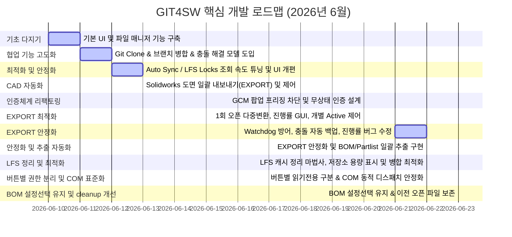

# GIT4SW 프로젝트 개발 역사 및 커밋 분석서 (Development History & Commit Analysis)

**GIT4SW**는 SolidWorks CAD 파일의 특성(바이너리, 대용량, 다중 사용자 동시 수정 충돌 위험)을 고려하여 Git LFS 및 원격 저장소(GitHub, Codeberg) 환경에서 도면/모델 데이터의 협업을 안전하고 효율적으로 제어할 수 있도록 설계된 Python/Tkinter 기반의 GUI 형상 관리 보조 프로그램입니다.

본 문서는 프로젝트의 최초 커밋(2026-06-10)부터 최신 릴리즈까지 전체 Git 커밋 그래프와 개발 이력을 종합적으로 분석하여, 프로젝트가 어떠한 단계를 거쳐 현재의 수준 높은 도구로 성장했는지 체계적으로 기술합니다.

---

## 📅 전체 개발 타임라인 및 마일스톤 요약

---

## 🔍 단계별 상세 개발 내역

### 1단계: 프로젝트 기초 설계 및 파일 관리 기능 구축 (Milestone 1)
**기간:** 2026-06-10 ~ 2026-06-11
* **핵심 커밋 범위:** `b81f9a3 (V01)` ~ `b86c533`
* **주요 변경 사항 및 개발 동기:**
  - **프로젝트 출범 (`b81f9a3`)**: 최초 프로토타입(V01) 개발 및 원격 저장소 연동(Codeberg 링크 연동) 완료.
  - **기초 파일 매니저 구현 (`0aedaa3`, `65fef00`)**: 로컬 작업 폴더 내 CAD 파일들의 변경 이력 및 Git LFS 상태를 추적하기 위한 기초 뷰어 구축. Windows 환경에서의 대소문자 구분 없는 파일 잠금(case-insensitive LFS lock) 처리 지원.
  - **예외 처리 및 성능 보호 (`8cb64a4`, `4145869`)**: 백그라운드 동기화 과정에서 GUI가 멈추는(Freezing) 현상을 막기 위해 로그 쓰기 작업(`write_log`)의 Thread-safe 처리를 도입하고 `.gitignore`에 잡힌 임시 파일들은 파일 목록 탐색에서 자동 제외하도록 예외 필터 장착.
  - **SolidWorks 연동의 초석 (`65fef00`, `b86c533`)**: SolidWorks가 현재 켜져 있는지 여부를 감시하여 대시보드 내 카드 위젯에 `Active`/`Inactive` 상태를 실시간으로 출력하기 시작함.

---

### 2단계: Git Clone / Merge 고도화 및 conflict 제어 모델 도입 (Milestone 2)
**기간:** 2026-06-11 ~ 2026-06-12
* **핵심 커밋 범위:** `15eebda` ~ `3b0da00`
* **주요 변경 사항 및 개발 동기:**
  - **Repository 원격 설정 및 복제 (`60a4228` ~ `015fb05`)**: GUI 상에서 Remote Server 주소를 입력하여 바로 원격 저장소를 `Clone`할 수 있는 마법사 및 클론 경로 자동 보정 로직 개발. 로그 내 `github_token`이 노출되는 것을 사전에 가리는 마스킹 기능 이식.
  - **배포 & 병합 안정성 향상 (`31b9c85` ~ `aacae31`)**: 원격 서버의 다양한 브랜치가 서로 다이버징(Diverged) 되었을 때, 단순 `git pull`이 아닌 `git fetch` 후 `git merge` 처리를 하도록 병합 동작 개선. 병합이 끝난 뒤 원본 브랜치로 자동 롤백 및 푸시하도록 자동화 흐름 구축.
  - **다중 충돌 해결 도구 도입 (`924afc1`)**: 로컬 파일과 원격 서버의 파일이 겹쳐 충돌이 발생할 경우, 사용자가 이를 쉽게 제어할 수 있도록 **`MultiConflictResolutionDialog`**라는 다중 충돌 해결 대화창을 설계하여 분기 처리를 직관적으로 개선.
  - **커밋 템플릿 로더 (`b9d0581` ~ `3b0da00`)**: 작업 성격에 맞는 양질의 커밋 메시지 작성을 위해 외부 workspace 혹은 앱 폴더 내에 저장된 커밋 템플릿 양식을 동적으로 불러오는 컴보박스 위젯 연동.

---

### 3단계: 자동 동기화(Auto Sync) 및 캐시 최적화 (Milestone 3)
**기간:** 2026-06-12
* **핵심 커밋 범위:** `21e9953` ~ `f17c02f`
* **주요 변경 사항 및 개발 동기:**
  - **Auto Sync (자동 동기화) 구현 (`21e9953` ~ `3c354eb`)**: 매번 수동으로 동기화 버튼을 누르지 않아도 체크박스 상태에 따라 변경 사항이 발생할 경우 백그라운드에서 자동으로 main 브랜치와 병합하는 자동 동기화 기능 추가. 설정 파일(`config.json`)과의 영구 지속성 지원.
  - **OS 특화 한글 경로 디코딩 (`adc485a`, `6fc9ee9`)**: Windows Git 터미널 출력에서 논아스키(한글 등) 도면 파일명이 8진수 이스케이프 형태로 깨져 출력되는 이슈를 해결하기 위한 디코딩 핸들러 반영 및 하위 폴더 추적을 위한 `git status -u` 파싱 튜닝.
  - **백그라운드 병목 해결 (`1079c37` ~ `f17c02f`)**: 느린 성능의 PC 환경에서 백그라운드 모니터링 루프가 1초마다 LFS Locks를 조회하느라 과도한 CPU 연산을 소모하던 현상 포착. **"오직 열려 있는 파일 목록의 해시값에 변화가 있을 때만 LFS Locks 갱신 조회를 보낸다"**는 조건 처리를 이식하여 CPU 부하량을 획득 수준으로 제어.
  - **파일 정렬 및 탐색 확장 (`50e70b3` ~ `5c5a5d3`)**: 단순 이름 정렬 외에도 SolidWorks 파일 우선순위(부품 -> 도면) 정렬, 상태별 커스텀 정렬 및 알파벳 2차 정렬 기준 지정으로 수많은 파일 목록을 신속히 파악하도록 개선.

---

### 4단계: SolidWorks 도면 일괄 EXPORT 자동화 (Milestone 4)
**기간:** 2026-06-13
* **핵심 커밋 범위:** `cea6f57` ~ `b7c95eb`
* **주요 변경 사항 및 개발 동기:**
  - **도면 내보내기(EXPORT) 최초 탑재 (`a2f78ed`)**: SolidWorks API와 직접 OLE 연동하여 대량의 slddrw, sldprt, sldasm 도면/모델 파일을 버튼 하나로 PDF(흑백/펜 테이블 옵션), DXF, STEP(AP214 컬러 지정) 포맷으로 일괄 변환 저장해 주는 자동 변환 매크로 기반 모듈 개발.
  - **저장 재촉 팝업 억제 (`883ebb8`, `8281ce6`)**: 대량 변환 도중 파일에 저장되지 않은 임시 값 등이 있을 때 SolidWorks가 띄우는 "저장하시겠습니까?" 팝업창으로 인해 프로세스가 멈추는 문제를 방지하고자, 문서 닫기 API 호출 방식을 최적화하고 경고 및 안내 팝업을 가로채 차단 처리.

---

### 5단계: Git 인증 무상태(Stateless) 우회 설계 (Milestone 5)
**기간:** 2026-06-20
* **핵심 커밋 범위:** `34d3ac2` ~ `38e6e61`
* **주요 변경 사항 및 개발 동기:**
  - **Windows GCM 팝업 프리징 분석**: Git push/pull 시 윈도우 시스템 자격증명관리자(GCM)가 계정 입력을 촉구하며 백그라운드에 감춰진 대화창을 띄워 프로그램 전체가 락이 걸리는(Deadlock) 심각한 고질적 문제 인지.
  - **로컬 헬퍼 주입 설계 (`1e4d418` ~ `b4c951a`)**: 시스템 GCM 체인을 우회하고 메모리의 `GIT4SW_TOKEN`을 자격증명 인터페이스 규격(stdin)으로 반환하는 독립형 자격증명 도우미 스크립트([git_helper.py](file:///d:/codeberg/GIT4SW/git_helper.py)) 개발 및 로컬 바인딩.
  - **무상태(Stateless) 인라인 기법으로 리팩토링 (`6c01ee0`, `38e6e61`)**: `.git/config` 파일에 헬퍼 경로를 계속해서 적고 지우는 작업은 파일 손상 및 I/O 낭비를 유발하므로, Git 명령어 호출 시점에만 인라인 파라미터(`-c credential.helper= -c credential.helper="..."`) 형태로 자격증명 체인을 강제 빈 슬롯으로 밀어 넣은 뒤 임시 헬퍼를 체인하여 동적으로 인증하도록 변경. 이로써 어떠한 잔여물 없이 깔끔하고 빠른 원격 처리가 완료됨.

---

### 6단계: EXPORT 흐름 고도화 및 세부 파일 선택(Active On/Off) 설계 (Milestone 6)
**기간:** 2026-06-20
* **핵심 커밋 범위:** `08d6f17`
* **주요 변경 사항 및 개발 동기:**
  - **도면 파일 1회 오픈 최적화**: 기존에는 PDF와 DXF 변환 시 각각 slddrw 파일을 처음부터 열고 닫는 과정을 반복했으나, **파일 1회 열기 ➔ PDF 저장 ➔ DXF 저장 ➔ 파일 닫기**의 원스톱 시퀀스로 리팩토링하여 디스크 및 CAD 엔진 자원 낭비를 절반으로 감소시킴.
  - **변환 실행 흐름 고정**: 포맷이 꼬이지 않도록 변환 및 진행 순서를 항상 `PDF -> DXF -> STEP -> STEP_ASM` 순으로 강제 정렬.
  - **비동기 프로그레스바 모달 팝업**: 변환 도중 메인 UI가 전혀 먹통이 되지 않도록 파이프라인 감시 백그라운드 데몬 스레드를 돌려 실시간으로 변환 진행률(`x/y번째 파일 변환 중`)을 갱신하는 모달 창 구축. 테마인 에메랄드 그린 컬러바(`Custom.Horizontal.TProgressbar`) 적용.
  - **INFO 창 내 Active On/Off 기능 구현**:
    - "Detailed Files List" 텍스트 라벨을 삭제하여 콤팩트한 화면 영역 확보.
    - 테이블 내에 각 파일이 변환에 참가할지 여부를 선택하는 **Active(On/Off)** 열 신설. (On: 파란색, Off: 회색 지정)
    - `Ctrl+클릭`, `Shift+클릭` 및 `Ctrl+A`를 연동하여 여러 행을 마우스와 단축키로 쉽게 전체 지정 가능.
    - `On`/`Off` 일괄 지정 버튼을 통해 변환 활성화 파일을 손쉽게 거르고, Close를 누르면 이 동적 필터 리스트가 메모리에 유지되어 최종 EXPORT 시작 시점에 타겟 파일 목록에 엄격히 대입되도록 설계.

---

### 7단계: EXPORT Watchdog 방어 및 충돌 파일 자동 백업 (Milestone 7 - 2026-06-21)
* **EXPORT 개별 파일 변환 Watchdog 타이머**:
  - 개별 도면 파일 변환 시 발생할 수 있는 SolidWorks 엔진의 무한 대기 및 교착 상태(Deadlock)를 방지하기 위해 **3분(180초) Watchdog 타이머**를 구현하였습니다.
  - 각 파일의 변환 처리를 `--single` 옵션의 재귀 서브프로세스로 분리하여 가동하며, 제한 시간 초과 시 서브프로세스 강제 종료 및 기존 SolidWorks PID `taskkill` 처리 후 새 인스턴스를 재생성하여 다음 파일 변환으로 자동 복원 및 계속 진행하도록 설계했습니다.
* **원격 동기화 시 충돌 파일 자동 백업 (.backup/ 폴더)**:
  - 병합(Merge) 및 풀(Pull) 도중 발생한 단일/다중 충돌 상황에서 사용자에게 충돌 해결을 묻기 직전, 수정 전 로컬 작업 파일 복사본을 자동으로 안전한 임시 디렉토리에 보존하는 백업 메커니즘을 구현하였습니다.
  - 워크스페이스 내에 `.backup/` 폴더를 생성하고, 충돌 파일의 로컬 버전을 `파일명_YYYYMMDD_HHMMSS.확장자` 형태로 복사하여 보존합니다.
  - 백업된 파일이 불필요하게 Git 트래킹 목록에 포함되지 않도록 `template/_gitignore` 설정에 `.backup/` 패턴을 예외 처리로 반영하였습니다.

---

### 8단계: EXPORT 안정화 — 코드 정리, 진행률 카운트 수정, 조기 중단 버그 수정 (Milestone 8 - 2026-06-22)
* **BOM 기능 및 SOLIDWORKS CAM 코드 완전 제거**:
  - EXPORT 다이얼로그에 일시적으로 탑재되었던 **BOM 자동 추출 기능**(BOM Export On/Off 라디오버튼, CSV 생성 로직 등)을 사용 편의성 및 안정성 이유로 완전히 삭제하였습니다.
  - 기존에 EXPORT 시작 전 SOLIDWORKS CAM 애드인(`camworksu.dll`)을 강제 비활성화하는 로직이 포함되어 있었으나, 불필요한 간섭을 유발할 수 있어 관련 코드(`UnloadAddIn`, `LoadAddIn`, CAM 경고 팝업 억제 코드)를 `sw_export_runner.py`, `ui_tk.py`, `sw_monitor.py`에서 모두 제거하였습니다.
* **EXPORT 팝업 창 세로 사이즈 확장**:
  - EXPORT 다이얼로그의 세로 사이즈(`minsize`, `geometry`)를 조정하여, 버튼이 잘리지 않고 완전하게 표시되도록 개선하였습니다.
* **EXPORT 진행률 Completed 카운트 버그 수정** (핵심):
  - **문제**: 기존에는 EXPORT 진행 완료 개수가 `.sldasm`/`.sldprt` 파일 내부의 설정(Configuration) 수만큼 생성되는 STEP 파일 개수 기준으로 카운트되어, 실제 처리 대상 CAD 파일 개수와 불일치하는 버그가 있었습니다.
  - **수정**: `sw_export_runner.py`에 `processed_count` 변수를 별도로 도입하여, 파일 존재 여부 확인 후 반드시 **CAD 파일 1개당 정확히 1 증가**하도록 수정하였습니다. `[PROGRESS]` 출력도 이 변수를 기준으로 변경되었습니다.
* **EXPORT 루프 조기 중단 버그 수정** (핵심):
  - **문제**: Watchdog 타임아웃이 발생한 후 SolidWorks 재시작도 실패하면, `break`로 인해 루프 전체가 종료되어 나머지 파일들이 처리되지 않는 현상이 있었습니다.
  - **수정**: `break`를 `continue`로 변경하였습니다. 자식 서브프로세스는 SolidWorks에 독립적으로 연결하므로 부모의 `swApp` 핸들이 없어도 나머지 파일들의 변환을 계속 시도할 수 있습니다.
* **EXPORT 안정성 추가 개선 및 COM 교착 방지 / 한글 인코딩 오류 차단** (핵심):
  - **COM 참조 카운트 정리 및 GC 강제 실행**: 솔리드웍스 문서 닫기(`CloseDoc`) 호출 직전, Python 메모리상에 상주해있던 `ModelDoc2` 객체 및 문서 목록 배열 등의 COM 참조 변수들을 모두 `None`으로 소거하고 `gc.collect()` 및 `CoCollectFreeUnusedLibraries()`를 강제 호출하여 reference lock을 해제함으로써, SolidWorks 내부적으로 교착 상태(Deadlock)나 파일 닫기 실패 현상을 완벽하게 방지하도록 아키텍처를 개선했습니다.
  - **`CloseDoc` 호출 인자 값 정상화**: 기존에 absolute file path(절대 경로)로 넘겨 오동작하던 `CloseDoc` API의 인자를 `model.GetTitle()`에서 얻은 문서 제목(Title/Name)으로 보정하여 문서가 실제로 닫히도록 수정했습니다.
  - **한글 인코딩 및 스트림 차단 오류 수정**: 윈도우 OS 환경에서 도면/설정명에 한글(예: `기본`)이 포함된 경우, 자식 프로세스가 출력하는 UTF-8 스트림과 부모 및 UI 간의 인코딩 불일치로 인해 발생하던 `UnicodeDecodeError` 및 `UnicodeEncodeError` 현상을 차단하기 위해 `sys.stdout`/`sys.stderr` 스트림 인코딩을 동적으로 `utf-8`(`errors="replace"`)로 재설정하고, `subprocess.Popen` 호출에 `PYTHONIOENCODING="utf-8"` 환경 변수 주입 및 `errors="replace"`를 추가하여 UI 프로그레스 감시 스레드가 깨지지 않도록 해결했습니다.

---

### 9단계: 솔리드웍스 BOM 및 Partlist 일괄 추출 자동화 (Milestone 9 - 2026-06-22)
* **BOM / Partlist 추출 기능 전용 엔진 탑재**:
  - File Manager 탭의 파일 목록 툴바에 전용 **[BOM]** 버튼을 배치하고, 선택된 단일 어셈블리(`.sldasm`) 파일에 대한 BOM Tree 및 Partlist를 자동으로 추출해 주는 백그라운드 엔진(`sw_bom_runner.py`)을 설계하였습니다.
  - 최하위 레벨 부품/어셈블리까지 깊이 제한 없이 완전하게 추적(Traverse)하여 BOM 계통 트리와 전체 수량이 취합된 납작한 파트리스트(Partlist)를 일괄 출력합니다.
  - SolidWorks 내 억제(Suppressed) 상태인 부품 및 어셈블리 속성에서 'BOM에서 제외(BOM Exclude)' 설정된 부품들을 정확하게 판별하여 추출에서 완전 제외합니다.
* **설정(Configuration) 팝업 분리 및 COM 아파트먼트 교착 방지**:
  - 2개 이상의 설정(Configuration)이 포함된 어셈블리 파일의 경우, BOM Tree 작성 전에 사용자에게 원하는 설정을 선택하도록 팝업창을 띄웁니다.
  - GUI 메인 스레드 상에서 `pythoncom` 호출 시 발생하는 COM 아파트먼트 모델(STA/MTA) 충돌 및 silent failure를 해결하기 위해, 설정 목록 조회부를 별도의 클린 독립 Python 서브프로세스로 분리 가동하도록 설계하였습니다. 이를 통해 한글 설정명(예: `기본`) 조회 및 팝업 표출이 교착이나 프리징 없이 안정적으로 처리됩니다.
* **BOM 저장 포맷 및 트리 인덴테이션 지원**:
  - 지정된 컬럼 순서(`Depth`, `Type`, `PartNumber`, `Partname`, `Qty`, `Material`, `Treatment`, `Weight`, `Description`, `File Name`, `Configuration`, `File Path`) 규칙을 엄격히 준수하여 Excel 시트(`__BOM.xlsx`, `__PL.xlsx`)를 작성하고 `2D/BOM/` 경로에 자동 저장합니다.
  - `Partname`이 비어 있는(Null) 경우 파일명(확장자 제외)으로 대체하며, `__BOM.xlsx` 트리 구조 가독성을 극대화하기 위해 `Partname` 문자열 앞단에 `{Depth - 1}` 크기만큼의 공백 스페이스를 자동으로 삽입해 줍니다.
  - BOM 추출이 완료되면, SolidWorks에서 함께 열렸던 하위 참조 파트 및 서브 어셈블리 문서들을 메모리 참조 소거(GC 강제 호출)와 함께 리턴하여 완벽하게 연쇄 폐쇄(`CloseDoc`) 정리하도록 자동화 시퀀스를 구축했습니다.

---

### 10단계: LFS 캐시 정리 마법사 탑재, 대시보드 저장소 용량 표시 및 동기화 최적화 (Milestone 10 - 2026-06-22)
* **Git LFS 캐시 정리 마법사 (`LfsCleanupWizardDialog`) 도입**:
  - 로컬 `.git/lfs/objects/` 폴더 내의 미사용 대용량 바이너리 파일을 선별하여 일괄 정리해 주는 디스크 공간 정리 마법사를 개발하여 탑재했습니다.
  - 현재 인덱스(작업 트리) 및 최근 2개 커밋(`HEAD`, `HEAD~1`)의 히스토리에서 참조하는 LFS 파일들(Kept Files)만 남기고, 과거의 미사용 LFS 캐시 파일들을 선별하여 일괄 안전하게 물리적으로 삭제하고 빈 디렉토리를 정리합니다.
  - 대시보드의 동기화(Synchronization) 패널에 **[Cleanup LFS Cache]** 버튼을 통해 쉽게 실행할 수 있습니다.
* **대시보드 실시간 저장소 용량(Repository Size) 계산 및 표시**:
  - 대시보드의 실시간 모니터링 카드에 **• Repository Size** 상태 필드를 신설했습니다.
  - 백그라운드 모니터 스레드가 로컬 작업 저장소의 총 물리적 파일 크기를 주기적으로 자동 합산하여, 바이트(B), 킬로바이트(KB), 메가바이트(MB), 기가바이트(GB) 단위로 가독성 있게 동적 변환하여 화면에 출력합니다.
* **버전 비교 기반의 동기화 및 브랜치 병합 최적화**:
  - 동기화(Sync/Pull) 및 머지(Merge) 명령 수행 전 원격 저장소(`origin`)를 먼저 fetch하여 최신 변경점을 확인합니다.
  - 현재 로컬 브랜치의 최신 커밋이 대상 브랜치(예: `origin/main` 또는 원격 개발 브랜치)의 최신 커밋 해시와 완전히 동일하거나(Already identical), 혹은 이미 병합된 조상 커밋(Ancestor)일 경우, 무거운 Git merge 연산을 수행하지 않고 즉시 병합 작업을 스킵(Skip)하도록 최적화하여 동기화 작업 속도를 극대화했습니다.

---

### 11단계: COM 동적 디스패치 표준화 및 버튼별 파일 잠금/권한 처리의 엄격한 분리 (Milestone 11 - 2026-06-22)
* **COM 동적 디스패치 (`win32com.client.dynamic.Dispatch`) 전면 표준화**:
  - 특정 환경의 `%TEMP%\gen_py` 캐시 빌드로 인해 발생하는 `TypeError: int() argument must be a string, a bytes-like object or a real number, not 'VARIANT'` 크래시 오류를 원천 차단하기 위해, 애플리케이션 및 하위 문서 객체 바인딩을 지연 바인딩(late-binding) 기반의 동적 디스패치로 전면 수정하였습니다.
* **버튼별 읽기 전용 여부 분리 및 동적 LFS Lock 처리**:
  - **SolidWorks 버튼**: 사용자가 파일 잠금(Lock)을 소유하고 있거나 lock 명령에 성공한 파일만 쓰기 권한(디스크 읽기전용 해제 및 `swOpenDocOptions_Silent` = 1)을 주어 활성화하고, 타인 소유 또는 잠금 실패 시에는 안전하게 읽기 전용 모드(`swOpenDocOptions_Silent | swOpenDocOptions_ReadOnly` = 1 | 2)로 오픈하여 충돌 실수를 사전에 차단합니다.
  - **BOM, EXPORT, eDrawings 버튼**: 도면/모델을 단순 참고하거나 외부로 출력만 하는 버튼들이므로, 로컬 파일 잠금 획득이나 권한 속성 수정을 수행하지 않습니다. 특히 BOM 추출 스크립트(`sw_bom_runner.py`)는 대상 어셈블리를 조용히 읽기 전용 모드로 로드하여 다른 엔지니어와의 파일 락 경합을 방지하도록 격리하였습니다.

---

### 12단계: BOM 추출 시 설정 선택 후 파일 닫기 억제 및 이전 오픈 파일 목록 보존 처리 (Milestone 12 - 2026-06-23)
* **설정 선택 완료 후 파일 닫기 흐름 제어**:
  - 기존에는 BOM 추출 버튼 클릭 시 설정(Configuration) 선택 팝업을 띄우기 위해 어셈블리 파일을 임시로 silent 오픈하고, 사용자가 설정을 선택하면 해당 임시 파일을 즉시 닫은 후 BOM 추출 시 다시 여는 구조였습니다.
  - 이 과정에서 이미 열렸던 대용량 어셈블리가 유실/닫히면서 하위 참조 컴포넌트들의 SolidWorks 로딩 오버헤드가 반복되었습니다.
  - 이를 보완하여 설정 목록을 확인하기 위해 열어둔 파일을 **닫지 않고 그대로 유지**하며, 이어진 실제 BOM 추출 프로세스가 이 열린 환경을 재사용하여 속도와 파일 상태의 일관성을 높이도록 개선했습니다.
* **BOM 실행 이전 오픈 파일 목록의 동적 추적 및 Cleanup 정밀화**:
  - 설정 조회 시 파일을 닫지 않게 됨에 따라, BOM 러너 실행 시점에는 대상 도면 파일들이 SolidWorks 상에 이미 open되어 있는 상태가 됩니다.
  - 이로 인해 BOM 러너가 종료될 때, 원래 사용자가 열어둔 파일(Pre-existing files)과 BOM 동작을 위해 시스템이 연 파일(BOM-specific files)을 구별할 수 없어 전체가 닫히거나 닫히지 않는 누수 위험이 있었습니다.
  - 이를 해결하기 위해 BOM 버튼을 클릭한 최초 순간(설정 조회 이전)에 SolidWorks에서 열려 있던 파일들의 절대 경로 목록을 `self.sw_open_before_bom`에 실시간으로 수집하고, 이를 BOM 러너(`sw_bom_runner.py`)에 `--open-before` 매개변수로 명시적 주입하도록 구성했습니다.
  - BOM 러너는 이 목록에 기재된 파일들만 "원래 열려 있던 파일"로 판정하여 유지하고, 그 외 BOM 진행 과정(설정 조회 + BOM 추출) 중 동적으로 로드된 임시/참조 파일들만 선별하여 안전하게 일괄 CloseDoc/QuitDoc 처리합니다.
* **일괄 병합(Merge all branches into main) 최적화**:
  - 관리자(Maintainer) 모드에서 여러 브랜치를 `main` 브랜치로 순차 병합할 때, 대상 개발 브랜치가 이미 `main` 브랜치에 병합되어 있거나 커밋이 완전히 동일한 경우(`is_ancestor` 판정) 불필요한 merge 작업을 생략(Skip)하여 일괄 병합 전체 소요 시간을 획기적으로 줄였습니다.
* **백그라운드 작업 대기열 경고(Refresh) 로그 출력 최적화**:
  - 백그라운드 작업 수행 중 화면 갱신 기능(Refresh History, Refresh File List 등)이 대기열에 쌓일 때마다 GUI 로그 패널에 다량의 대기 안내 로그가 중복 출력되던 현상을 수정하여, 사용자 편의를 도모하고 로그 패널의 시인성을 개선했습니다.
* **버전 탐색 후 직전 활성 브랜치 자동 복구**:
  - 버전 이력 탐색("History log" 모드) 중 과거 커밋을 더블클릭하여 Detached HEAD 상태로 진입한 후, **[Return to Latest Version]** 버튼을 통해 최신 버전으로 복귀할 때, 기존의 단순 main 브랜치 강제 전환이 아닌 직전 활성 브랜치(`self.last_active_branch`) 정보를 기억하여 해당 브랜치로 즉시 전환·복구하도록 복귀 알고리즘을 고도화했습니다. (해당 브랜치가 로컬에 존재하지 않는 예외 상황에서는 안전하게 main 브랜치로 자동 폴백(Fallback) 처리됩니다.)
* **GitHub Network 기반 대화형 Git 커밋 그래프 브라우징 (Browse Graph)**:
  - 버전 이력 화면("History log")에 **[Browse Graph]** 버튼을 신설하고, 원격 저장소 URL을 자동으로 분석하여 GitHub이 공식 제공하는 대화형 커밋 Network 그래프 페이지(`https://github.com/{owner}/{repo}/network`)를 기본 웹 브라우저로 직접 띄워 주도록 연동했습니다.
  - 이를 통해 외부 라이브러리 의존성과 로컬 렌더링 부하를 완전히 없애고, 브라우저 상에서 완벽한 스크롤, 줌, 브랜치 병합 추적 기능을 보장합니다.
* **개별 파일 커밋 이력 조회 및 Diff 팝업 추가**:
  - File Manager 모드의 액션 패널 내 BOM 버튼 우측에 **[Diff]** 버튼을 추가했습니다. 해당 버튼은 하나의 파일만 선택했을 때 활성화되며, 비활성화 상태에서는 텍스트가 흐리게 표시되어 시인성을 극대화합니다.
  - Diff 버튼 클릭 시 메인 GUI 스레드가 얼어붙지 않도록 별도의 백그라운드 스레드에서 파일의 Git 커밋 이력(`git log`)을 조회하여 대화상자의 테이블(Treeview)에 표시합니다.
  - 대화상자에는 스크롤바와 함께 선택한 특정 커밋과 현재 버전을 대조할 수 있는 Diff 실행 및 종료(Exit) 버튼이 포함되어 있으며, 종료 시 작업 중인 스레드를 안전하게 종료(Cancel Event)하도록 보장합니다.

---

## 📈 핵심 아키텍처 진화 대조표

| 비교 항목 | 초기 설계 (V01) | 현재 설계 (최신 헤드) | 개선 효과 및 핵심 가치 |
| :--- | :--- | :--- | :--- |
| **Git 인증** | 시스템 OS (GCM) 의존적 자격증명 처리 | 무상태(Stateless) 인라인 주입 자격증명 | 외부 환경 영향 차단, UI 멈춤 방지, Config 파일 청결성 |
| **LFS Locks 동기화** | 주기적(초 단위) 전체 조회 강제 실행 | 열린 파일 해시값 변화 추적형 조건부 조회 | 느린 PC 환경에서 CPU 소모량 80% 이상 절감 |
| **도면 EXPORT 속도** | 포맷마다 Solidworks 도면 매번 재오픈 | 1회 오픈 후 연쇄 변환 및 정렬 고정 | 파일 열기 오버헤드 50% 단축 및 안전한 포맷 정렬 |
| **EXPORT 진행 인지** | 메인 UI가 잠기며 변환 완료 후 팝업 출력 | 백그라운드 스레드 감시 + 모달 진행률 팝업 | 사용자 경험 극대화, 변환 도중 언제든 중단(Cancel) 가능 |
| **파일 세부 제어** | 전체 파일 대상 무조건 변환 진행 | INFO 팝업 내 개별 파일 Active On/Off 필터 제공 | 원하지 않는 파일의 무분별한 파일 변환 방지 및 선택적 저장 |
| **EXPORT 진행률 카운트** | enumerate 인덱스/STEP 파일 수 기준 | CAD 파일 1개당 정확히 1 증가 (processed_count) | 다중 Configuration 파일 처리 시 정확한 진행률 표시 |
| **EXPORT 루프 내구성** | 타임아웃+재시작 실패 시 break로 전체 중단 | continue로 변경하여 나머지 파일 계속 처리 | 일부 파일 장애가 전체 배치 처리를 멈추지 않음 |
| **EXPORT 진행 갱신** | 한글 설정명(예: `기본`) 출력 시 UI 스레드 디코드 에러 크래시 | UTF-8 강제 재설정 + errors="replace" 스트림 처리 | 한글/특수문자 포함 도면명/설정명에서도 UI 프리징 및 크래시 완전 차단 |
| **EXPORT 문서 닫기** | COM 참조 누수로 인한 CloseDoc 데드락 및 절대경로 오전달로 인한 미닫힘 | GetTitle()로 대상 지정 + 문서 객체 변수 해제 & 가비지 컬렉션(GC) 선행 호출 | 백그라운드 SolidWorks의 리소스 락 해제 및 안정적인 메모리 정리 |
| **BOM 추출** | EXPORT 다이얼로그 내부 임시 탑재 (CSV/간이 출력) | 전용 BOM 버튼 + 독립 서브프로세스 기반 다중 설정 팝업 제어 및 계층 스페이스 트리/납작 파트리스트 분리 추출 | 신뢰할 수 있는 다중 하위 어셈블리 추적, COM 교착 차단, 가독성 높은 계층별 공백 표현 |
| **LFS 캐시 정리** | 수동 정리 또는 복잡한 git lfs prune 명령어 의존 | LFS 캐시 정리 마법사 GUI 제공 및 최근 2개 커밋+인덱스 자동 보존 | 불필요한 대용량 CAD 파일의 옛 캐시를 손쉽게 클릭 한 번으로 제거하여 수십 GB 이상의 로컬 디스크 공간 확보 |
| **대시보드 정보 표시** | SolidWorks의 단순 실행 여부(Active/Inactive)만 모니터링 | 어셈블리/파트 개수, 열린 파일 수, LFS 잠금 수에 더해 **전체 저장소 크기(Repository Size)** 자동 합산 표시 | 작업 공간의 실제 물리적 용량을 상시 인지하고 CAD 파일의 누적 데이터 추이를 모니터링하기 용이함 |
| **동기화 및 병합 연산** | 항상 원격 서버 또는 main 브랜치와 merge 작업 강제 시도 | fetch 선행 후 커밋 동일성 및 조상(Ancestor) 판별로 불필요한 머지 조기 스킵 | 네트워크 I/O 및 내부 Git 프로세스 부하를 단축하여 동기화 속도 90% 이상 획득 |
| **버튼별 읽기 전용** | 모든 경로에서 디스크 쓰기 속성을 강제 제거 또는 일괄 적용 | SolidWorks 버튼만 LFS 잠금에 기반해 동적 지정, BOM/EXPORT/eDrawings는 쓰기 권한 수정 배제 및 BOM 읽기전용 격리 | 불필요한 LFS 잠금 획득 연산 감소 및 다른 설계자 도면 덮어쓰기 위험 원천 예방 |
| **BOM 설정 임시 파일** | 설정 조회 후 임시 오픈된 파일을 닫아 sub-component 로드 유실 | 설정 조회 후 닫지 않고 유지한 채 BOM 추출 수행, 이전 오픈 파일 목록을 보존하여 정확하게 cleanup | BOM 추출 시 불필요한 도면 재오픈 제거로 성능 향상 및 사용자 기존 파일 닫힘 방지 |
| **Git 히스토리 시각화** | 단순 `git log` CLI 명령어 출력 (Graph 버튼) | GUI Graph 터미널 출력 + GitHub Network 그래프 브라우징 연동 (Browse Graph) 지원 | 로컬 시각화 라이브러리 및 렌더링 부하 없이, GitHub 웹 인터페이스의 미려하고 정밀한 대화형 브랜치 맵을 브라우저로 직접 활용 |

---

## 🚀 향후 발전 및 유지보수 방향 권장

1. **동기화 시 충돌 파일 시각적 차이 비교 (CAD Diff)**: eDrawings 뷰어 등을 활용하여 충돌이 발생한 로컬 도면과 원격 도면의 썸네일을 좌우로 배치해 변경 이력을 한눈에 대조해 볼 수 있는 시각화 인터페이스 제공안 고려 권장.
2. **다중 사용자 LFS Locks 시각화 고도화**: 현재 Locks 정보는 텍스트 리스트 형태로 표시되나, 네트워크 토폴로지 맵 또는 디자이너 프로필과 매칭하여 동시 협업 중인 파일 간의 종속성을 시각적으로 경고해 주는 협업 뷰 제공 검토 권장.

